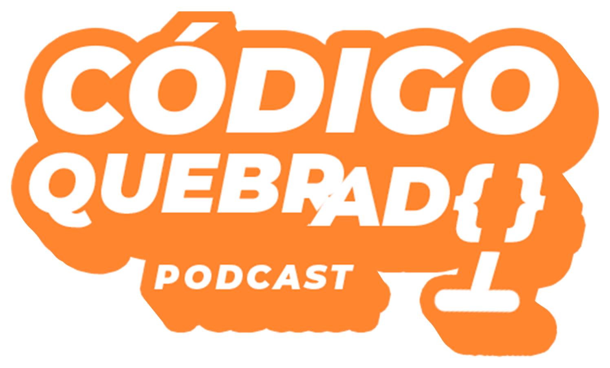
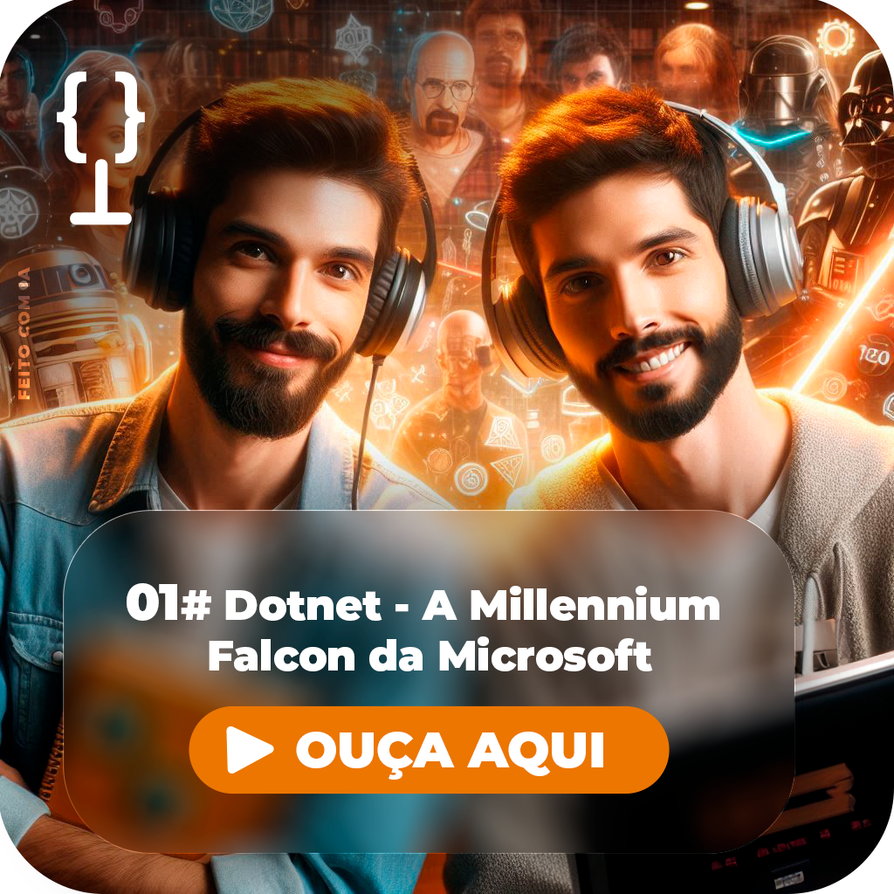
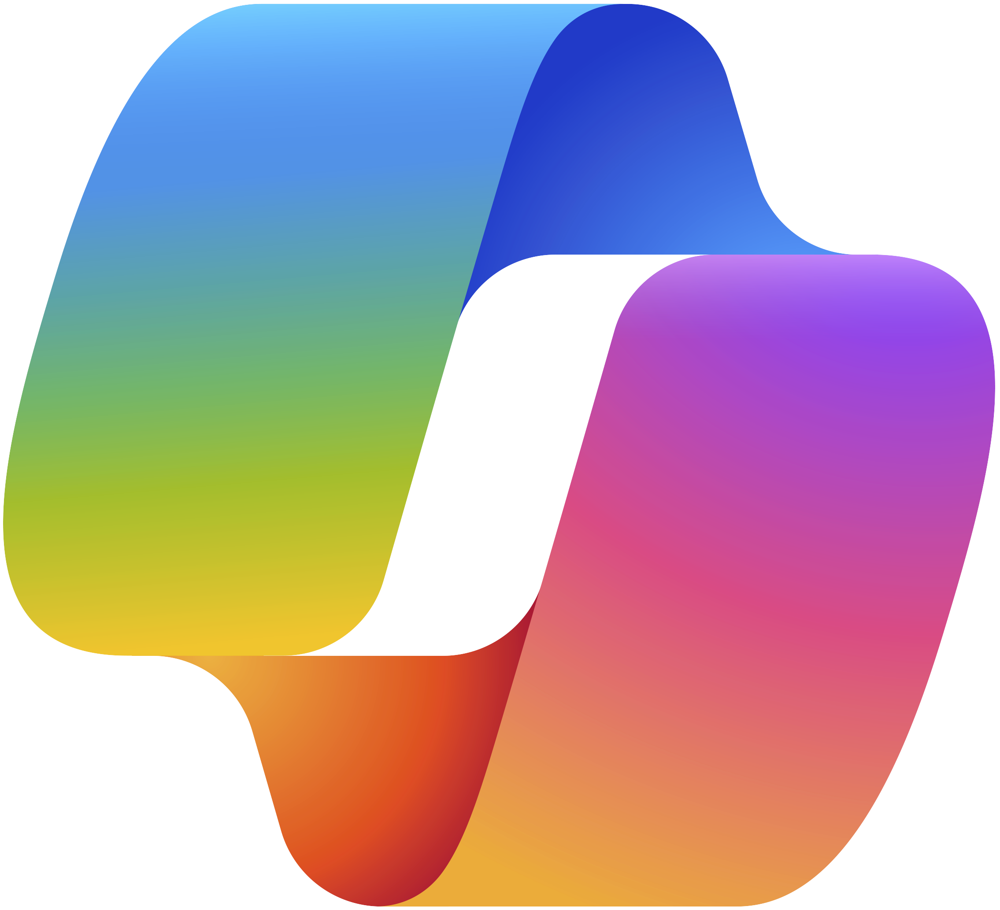
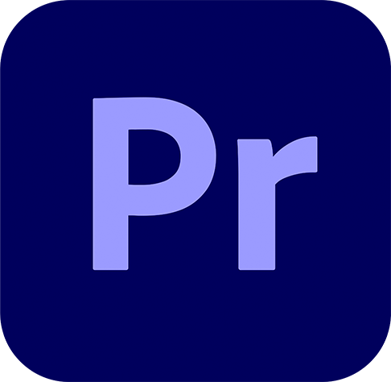
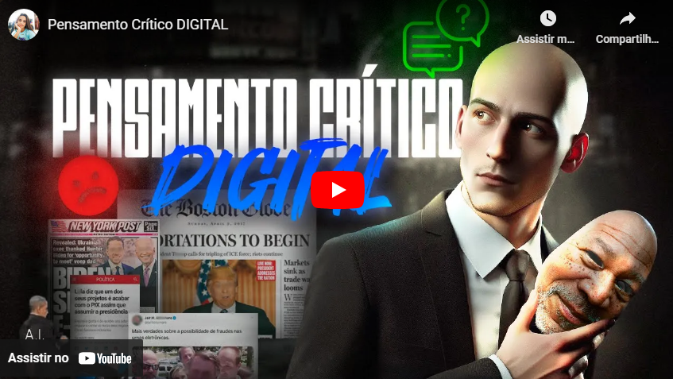
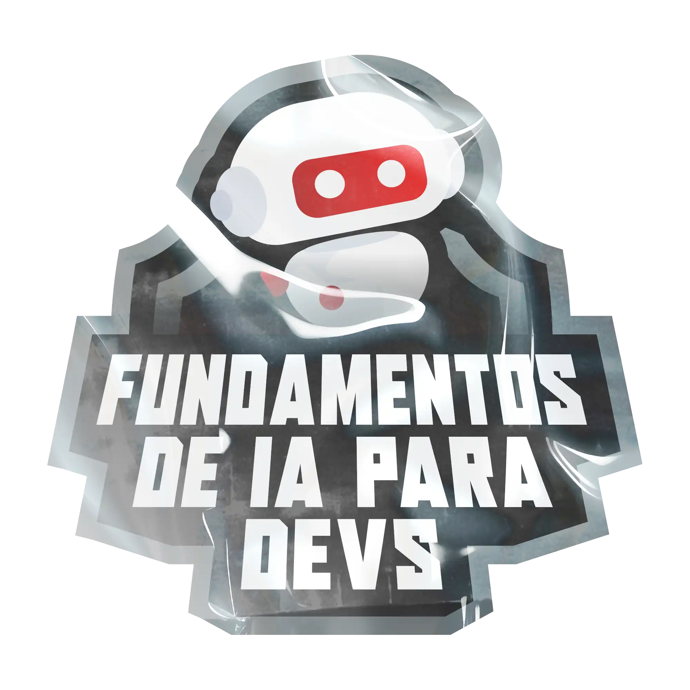

# Podcast com IA🎙️



_Design by **Amanda Meneghini**_

## Descrição 📒 

**Podcast geek e divertido** desenvolvido desde a concepção de nome ao audio das vozes, **gerado por recursos de Inteligência Artíficial, por revisão humana** 🤖 🧑‍🦲 

# Prompts 👩‍💻
## ✍️ Nome 
```
Você é um roteirista de Podcast e vamos criar um podcast de etcnologia 
focadoem fullstack e eu gostaria de uma ajuda sua com 5 sugestões de nomes
criativos para um podcast fullstack feito por geeks, e que tenha alguns 
trocadilho geek no nome

O podcast vai falar sobre dicas e novidades sobre o mundo do fullstack e o que
está acontecendo no mercado de tecnologia e de emprego

{REGRAS}
> O nome deve ser enxuto, um nome e um subtítulo
> O nome tenha algum trocadilho da cultura geek com nomes de franquias conhecidas, como: 
breaking bad
> O nome deve conter  alguma palavra forte que remete a fullstack

{NEGATIVAS}

>Não quero que o nome contenha palavras em inglês no título
>Não utilize a palavra "fullstack" no nome nem qualquer variação delas
```


### 🚩 Resultado de nome escolhido 
**"Código Quebrado - Descompilando o Mundo do Desenvolvimento"**

_ChatGPT_
## 📃 Roteiro

### part 1 
```
Me indique uma estrutura inxuta de uma pilula de podcast com no máximo 3min, que seja atrativa ao ouvinte

{REGRAS}
>Leve em consideração a análise dos melhores podcasts de technologias do mundo
```
### part 2
```
Baseado neste modelo em que você gerou
criar um  roteiro de um podcast de tecnologia, focado em fullstack cujo o nome é "Código Quebrado - Descompilando o Mundo do Desenvolvimento", com os apresentadores "Tadeu" e "Jhonny" - com a personalidade hipster e geek - e tem foco no mundo da tecnologia e em fullstack,  com o público alvo de iniciantes em fullstack

o formato do roteiro deve ser baseada na estrutura anterior gerada por você

 {REGRAS}
- no bloco [Ponto Principal] coloque como tema, o que é ".NET" - dotnet - e "C#" - csharp
- traga curiosidades e dados relevantes 
- use termos de fácil explicação e objetividade 
- use referências geeks como a série Breaking Bad e Star Wars

{REGRAS NEGATIVAS}
- Não use muitos termos técnicos
- Não ultrapasse 3 minutos de duração
```

<strong><a href="https://chatgpt.com/share/66ef7277-4e64-8010-83de-e3c21513ca73" target="_blank">Conversa completa com chatGPT</a></strong> ⬅️

# Resultado Final 🫣
[](https://drive.google.com/file/d/1WmQ-sNvvRMOhnx6YjP7nOgDODiXBc0dx/view?usp=sharing)


# Trilha Sonora 🔈🎶

**Música Inicial do Podcast -** [**Breaking Bad [MetroGnome Remix]**](https://soundcloud.com/itsmetrognome/breaking-bad-metrognome-remix?in=itsmetrognome/sets/itsmetrognome) 

**Música de Fundo do Podcast -** [**RomanBelov Coffee Chill Out**](https://pixabay.com/pt/music/batidas-coffee-chill-out-15283/)

## 🗂 Estrutura do Projeto
```
/
├── assets/
│   └── images/     # Imagens utilizadas
|   └── logos/      # logos utilizados
|
├── audios/         # Audio Podcast em .mp3, .wav e .ogg
│   └── licences/   # licença de fundo Pixabay
|
├── docs/           # Roteiro editado e original .md
│   
└── README.md       # Este arquivo
    
```

# Ferramentas Utilizadas ⚗️🧪
<div style="display: flex; gap: 15px">
    <a href="https://openai.com/chatgpt/" target="_blank"></a>
    <a href="https://elevenlabs.io/" target="_blank"></a>
    <a href="https://copilot.microsoft.com/" target="_blank"></a>
    <a href="https://www.adobe.com/br/products/photoshop.html" target="_blank"></a>
    <a href="https://www.adobe.com/br/products/premiere.html" target="_blank"></a>
</div><br>


## Outro projeto feito com IA 🤖
<a href="https://www.youtube.com/embed/7S8Ss7oKJzU?si=MG5W3JxomRGAxHxK" target="_blank"></a>

## 👨‍💻 Autora

<p>
    
    <p>&nbsp&nbsp&nbspAmanda Meneghini<br>
    &nbsp&nbsp&nbsp
    <a href="https://github.com/AmandaMeneghini" target="_blank">GitHub</a>&nbsp;|&nbsp;
    <a href="https://www.linkedin.com/in/amanda-meneghini/" target="_blank">LinkedIn</a>
    &nbsp;&nbsp;
    </p>
<br><br>


# Nota 📝



&nbsp;<p>Desafio proposto pelo professor [**Felipe Aguiar**](https://www.linkedin.com/in/felipeaguiar-exe/), no **Bootcamp Fundamentos de IA para Devs** da [**DIO**](https://www.dio.me/) em parceria com o [**Banco Santander**](https://www.linkedin.com/company/banco-santander/)</p>

 <br>

 **Obrigada** por ver até aqui 💛 by [Amanda Meneghini](https://github.com/AmandaMeneghini)