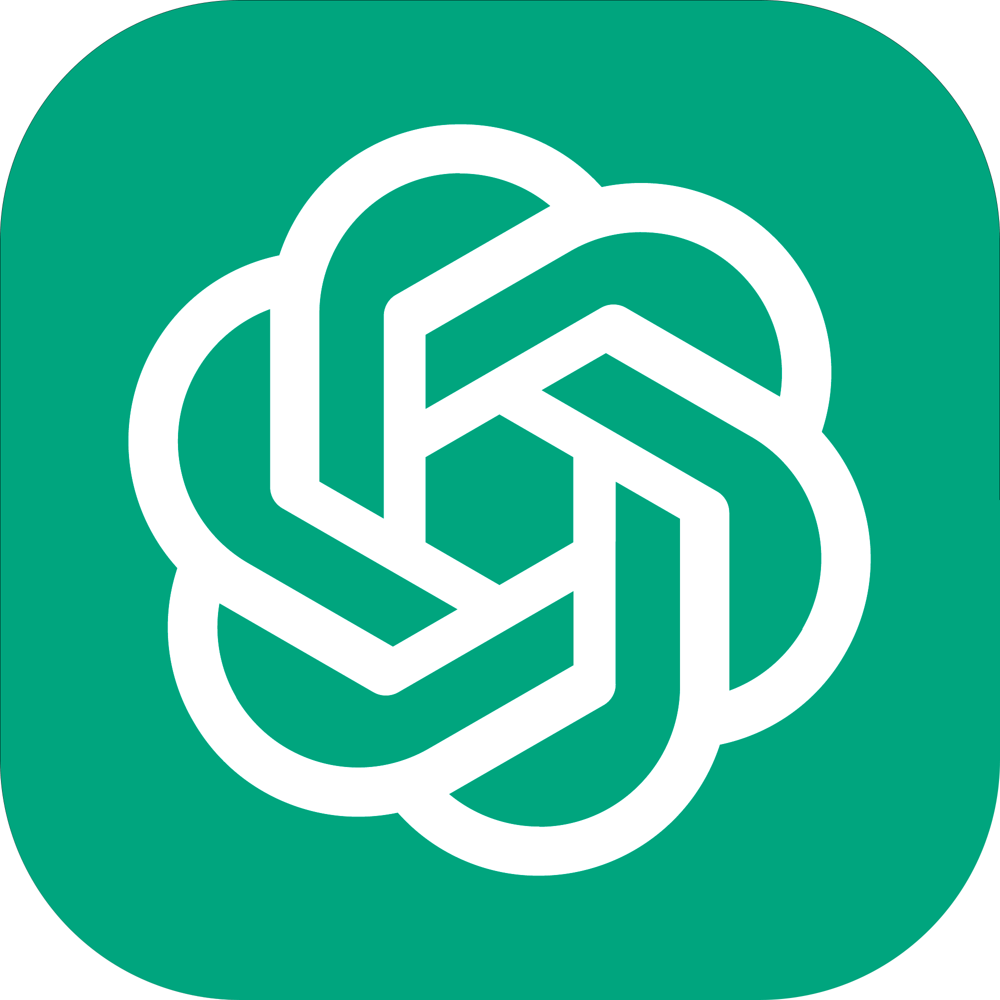
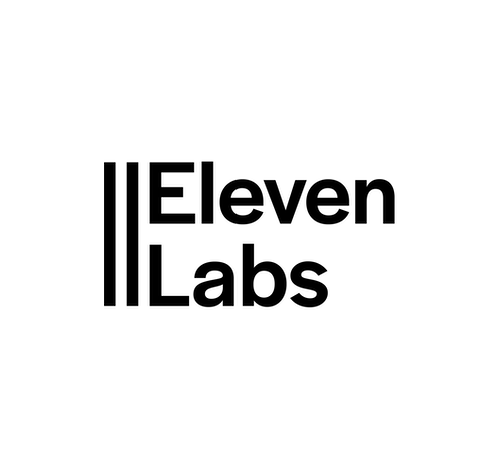

# Podcast com IA 🎙️
## 📒 Descrição 

# Prompts 👩‍💻
## ✍️ Nome 
```
Você é um roteirista de Podcast e vamos criar um podcast de etcnologia 
focadoem fullstack e eu gostaria de uma ajuda sua com 5 sugestões de nomes
criativos para um podcast fullstack feito por geeks, e que tenha alguns 
trocadilho geek no nome

O podcast vai falar sobre dicas e novidades sobre o mundo do fullstack e o que
está acontecendo no mercado de tecnologia e de emprego

{REGRAS}
> O nome deve ser enxuto, um nome e um subtítulo
> O nome tenha algum trocadilho da cultura geek com nomes de franquias conhecidas, como: 
breaking bad
> O nome deve conter  alguma palavra forte que remete a fullstack

{NEGATIVAS}

>Não quero que o nome contenha palavras em inglês no título
>Não utilize a palavra "fullstack" no nome nem qualquer variação delas
```

### 🚩 Resultado escolhido 
"Código Quebrado - Descompilando o Mundo do Desenvolvimento "

_ChatGPT_
## 📃 Roteiro

```

```

_ChatGPT_
# Tecnologias 🛠️
<div style="display: flex; gap: 5px">
    
    
</div>
